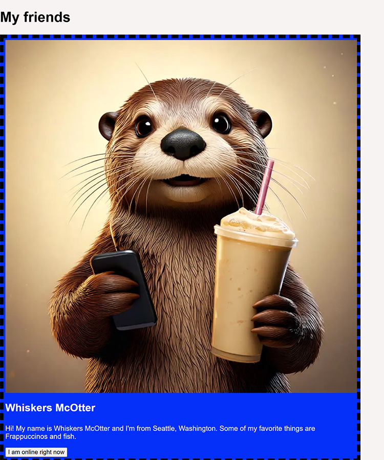

**Modifying Element Styling**
---
Let's dig into some code and use what we've learned.

For this exercise you're going to be given webpage with little to no styling. Let's be honest and just call it 'bad' styling.

Your goal will be to use the methods you've learned to add the needed styles to the page. When you're finished, it should look like this...


Unfortunately, right now it looks like this...



Yikes.

Let's clean that up.

**Requirements:**
---
Your job is to create a function that will correctly modify the classes and styling of the webpage to match the example.

**DO NOT EDIT ANY OF THE CSS OR HTML.**

You can make all the changes you need just by using JavaScript. Don't create or modify any styles. Make your code work within the constraints provided.

Use the .classList property as well as its methods to make most of your changes.

Pay attention. You may need to change a few things that might not be clear at first.

Make sure your final result matches the one given.

Remember that for each element you modify, you'll have to get the element from the DOM first. Some of these HTML elements don't have any classes or identifiers on them. Remember, DON'T EDIT THE HTML.
How can you get those elements by moving around the DOM? Revisit the lesson on traversing the DOM and see what methods you can use.

**Getting Started:**
---
Your GitHub repo is available right here.

Clone this repo into your local environment and then open the index.html in your default browser. You should see the unstyled version of our old friend, Whiskers.

Open the scripts.js file in your IDE and you'll see a function called restyleOtter().  This is where your code will go.

Remember you don't need to do anything other than select DOM elements and modify the classes and styling as needed. Don't touch the HTML or CSS.

**Tips:**
---
Remember there's a difference between using a property like .firstElementChild and .firstChild. Don't let that catch you. When in doubt, console log your results and make sure you're selectors return what you want.
\
There's one element that could really use a .toggle() method. It doesn't have  to use it, but would make sense. Which element could best use a .toggle()?

Also, you can go in and reverse engineer the CSS if you want to really stretch a bit. But that can be a pain, if you want, the final HTML is listed below. This is what the result should be when you're done.

```
<body>
    <div class="title">
    <h1>My friends</h1>
</div>
    <section id="cardContainer">
        <div class="profileCard">
            <div class="picFrame">
                
            </div>
            <div class="userInfo">
                <div>
                    <h2>Whiskers McOtter</h2>
                    <p>Hi! My name is Whiskers McOtter and I'm from Seattle, Washington. Some of my favorite things are
                        Frappuccinos and fish.</p>
                </div>
                <div>
                    <button class="active">Online now!</button>
                </div>
            </div>
        </div>
    </section>
</body>
```
